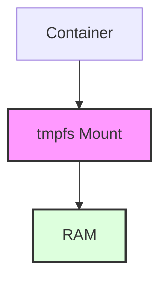
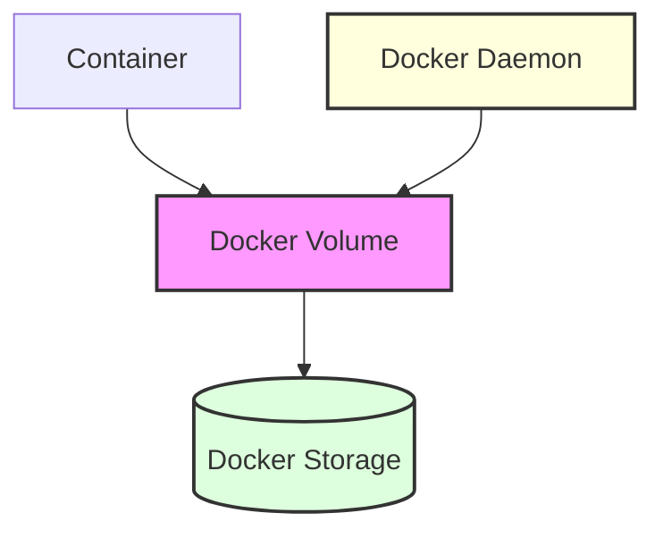
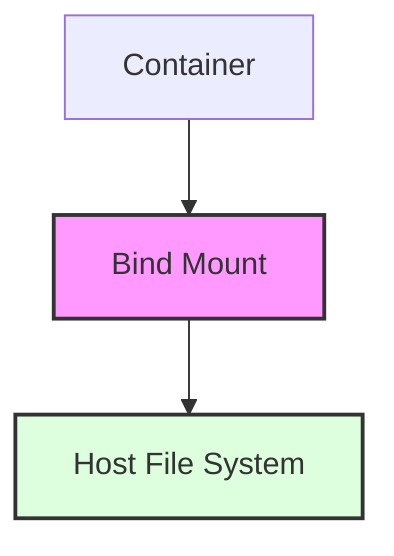

# Understanding Docker Storage Types
## A Comprehensive Guide to Docker Volumes and Storage Management

### Table of Contents
1. Introduction
2. Types of Docker Storage
   - tmpfs Mounts
   - Docker Volumes
   - Bind Mounts
3. Working with Docker Volumes
4. Best Practices
5. Command Reference

## 1. Introduction

Docker containers are ephemeral by nature, meaning any data inside them is lost when the container is removed. However, Docker provides three different storage options to manage data persistence and sharing between containers and the host system.

## 2. Types of Docker Storage

### 2.1 tmpfs Mounts


**Key Characteristics:**
- Stored in the host system's memory
- Temporary storage that exists only during container runtime
- Data is lost when container stops
- Faster read/write operations
- Useful for sensitive information like secrets

**Use Cases:**
- Temporary application cache
- Session data
- Sensitive information that shouldn't be persisted

### 2.2 Docker Volumes

Explanation for each component of this diagram:

Components:

A[Container]: This represents a Docker container, which is your running application
B[Docker Volume]: This is the Docker volume, colored in pink (#f9f)
C[(Docker Storage)]: This represents the physical storage location (/var/lib/docker/volumes/), colored in light green (#dfd)
D[Docker Daemon]: This is the Docker engine/service that manages everything, colored in light yellow (#ffd)


Relationships (Arrows):

Container --> Docker Volume: Shows that the container uses the Docker volume for storage
Docker Volume --> Docker Storage: Indicates that the volume data is physically stored in Docker's storage area
Docker Daemon --> Docker Volume: Shows that the Docker daemon manages and controls the volume


Flow of Operations:

When a container needs to store data:

The container writes to its mounted volume path
The Docker volume system handles this write operation
The data is physically stored in Docker's storage area
All of this is managed by the Docker daemon

**Key Characteristics:**
- Managed by Docker daemon
- Located in `/var/lib/docker/volumes/`
- Persistent storage
- Can be shared between containers
- Platform-independent
- Volume drivers for remote storage

**Use Cases:**
- Database storage
- Application data that needs to persist
- Shared data between containers
- Backup and restore operations

### 2.3 Bind Mounts


**Key Characteristics:**
- Stored anywhere on host system
- Direct mapping to host filesystem
- Host system dependent
- Can affect container portability
- Full host system permissions

**Use Cases:**
- Development environments
- Configuration files
- Static website content
- Source code mounting

## 3. Working with Docker Volumes

### Common Volume Commands
```bash
# List all volumes
docker volume ls

# Create a new volume
docker volume create my_volume

# Inspect a volume
docker volume inspect my_volume

# Remove unused volumes
docker volume prune

# Remove specific volume
docker volume rm my_volume
```

### Example Usage with Containers
```bash
# Using a named volume
docker run -d \
  --name postgres_db \
  -v postgres_data:/var/lib/postgresql/data \
  postgres:latest

# Using a bind mount
docker run -d \
  --name nginx_web \
  -v /host/path:/usr/share/nginx/html \
  nginx:latest

# Using tmpfs
docker run -d \
  --name temp_container \
  --tmpfs /tmp:rw,noexec,nosuid,size=100m \
  ubuntu:latest
```

## 4. Best Practices

1. **Volume Naming**
   - Use descriptive names for volumes
   - Implement a consistent naming convention
   - Document volume purposes

2. **Security**
   - Use tmpfs for sensitive data
   - Set appropriate permissions
   - Regular backup of important volumes

3. **Performance**
   - Use tmpfs for high-performance temporary storage
   - Consider volume drivers for specific use cases
   - Monitor volume usage and cleanup

4. **Maintenance**
   - Regular pruning of unused volumes
   - Implement backup strategies
   - Monitor storage usage

## 5. Command Reference

| Command | Description |
|---------|-------------|
| `docker volume create` | Create a new volume |
| `docker volume ls` | List all volumes |
| `docker volume inspect` | Display volume details |
| `docker volume prune` | Remove unused volumes |
| `docker volume rm` | Remove specific volumes |

### Volume Creation with Options
```bash
# Create volume with custom driver
docker volume create --driver local \
  --opt type=none \
  --opt device=/path/on/host \
  --opt o=bind \
  my_volume

# Create volume with labels
docker volume create --label environment=prod \
  --label project=webapp \
  webapp_data
```

---

## Summary

Understanding Docker storage types is crucial for:
- Data persistence
- Container data management
- Application performance
- Security considerations
- System maintenance

Choose the appropriate storage type based on your specific use case:
- tmpfs for temporary, sensitive data
- Docker volumes for persistent, portable storage
- Bind mounts for development and specific host system integration

Remember to regularly maintain your volumes and follow best practices for optimal performance and security.
